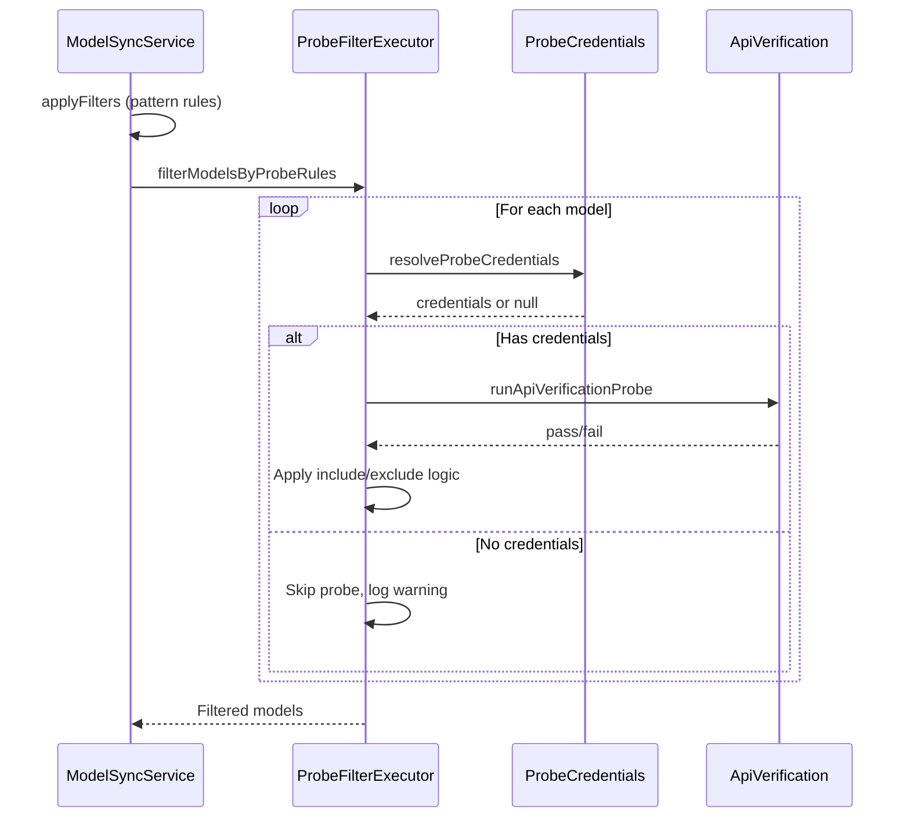

# 渠道 Probe 探测型过滤规则

## 功能简介

为渠道过滤规则系统添加了基于 API 探测的智能过滤能力，允许通过实际 API 调用测试模型能力，根据探测结果自动过滤模型列表。

## 快速开始

### 1. 配置校验凭证

#### 方式 A: 从 API 凭证自动带入（推荐）

1. 在 **API 凭证管理** 页面添加或选择一个凭证
2. 点击"导出到托管站点"创建渠道
3. 校验凭证会自动保存，无需手动配置

#### 方式 B: 手动配置

1. 在 **渠道管理** 页面，点击某个渠道的"编辑渠道过滤规则"
2. 在对话框顶部的 **"渠道校验凭证"** 区域填写：
   - Base URL: 如 `https://api.openai.com/v1`
   - API 密钥: 如 `sk-...`
   - API 类型: 如 `openai-compatible`
3. 点击"保存校验凭证"

### 2. 添加探测规则

1. 在过滤规则对话框中，点击 **"新增规则"**
2. 选择 **"探测型规则"**
3. 配置规则：
   - **规则名称**: 如"支持工具调用的模型"
   - **探测类型**: 选择要测试的能力（如"工具调用探测"）
   - **API 类型**: 选择 API 类型（如"openai-compatible"）
   - **执行动作**: 选择"包含"或"排除"
   - **校验凭证**（可选）: 留空则使用渠道默认凭证
4. 点击"保存规则"

### 3. 触发模型同步

1. 在渠道列表中，点击该渠道的"同步"按钮
2. 探测规则会自动应用，过滤出符合条件的模型

## 探测类型说明

| 探测类型 | 说明 | 用途 |
|---------|------|------|
| 模型列表探测 | 测试模型是否在 API 的模型列表中 | 验证模型可用性 |
| 文本生成探测 | 测试基础文本生成功能 | 确保模型支持基本对话 |
| 工具调用探测 | 测试 Function Calling / Tool Use | 筛选支持工具调用的模型 |
| 结构化输出探测 | 测试 JSON Schema 约束输出 | 筛选支持结构化输出的模型 |
| 联网搜索探测 | 测试联网搜索功能 | 筛选支持联网的模型 |

## 使用场景

### 场景 1: 只同步支持工具调用的 GPT-4 模型

**需求**: 渠道只需要支持 Function Calling 的 GPT-4 系列模型

**配置**:
1. 规则 1 (模式匹配): 包含 `gpt-4`
2. 规则 2 (探测型): 包含 - 工具调用探测

**结果**: 只有通过工具调用探测的 GPT-4 模型会被同步

### 场景 2: 排除不支持联网的模型

**需求**: 应用需要联网搜索能力，排除不支持的模型

**配置**:
1. 规则 1 (探测型): 排除 - 联网搜索探测（探测失败）

**结果**: 所有不支持联网搜索的模型会被排除

### 场景 3: 精细化模型筛选

**需求**: 只要 Claude 系列中支持结构化输出的模型

**配置**:
1. 规则 1 (模式匹配): 包含 `claude`
2. 规则 2 (探测型): 包含 - 结构化输出探测

**结果**: 先通过模式匹配缩小到 Claude 系列，再通过探测筛选出支持结构化输出的模型

## 性能建议

### ⚠️ 重要提示

探测规则会对每个模型执行实际的 API 调用，可能：
- 消耗时间（每个探测默认最多 30 秒）
- 消耗 API 配额
- 受 API 速率限制影响

### 最佳实践

1. **先用模式匹配缩小范围**
   ```
   规则 1 (Pattern): 包含 "gpt-4"  ← 先缩小到 GPT-4 系列
   规则 2 (Probe): 包含 - 工具调用探测  ← 再精细筛选
   ```

2. **避免对大量模型直接探测**
   ```
   ❌ 不推荐: 直接对 100+ 模型应用探测规则
   ✅ 推荐: 先用模式匹配减少到 10-20 个模型，再探测
   ```

3. **合理使用探测规则**
   - 只在确实需要验证能力时使用
   - 考虑使用模式匹配替代（如果模型命名有规律）

## 凭证配置详解

### 凭证解析优先级

探测规则按以下顺序查找凭证：

```
规则级凭证 → 渠道级凭证 → 渠道自身凭证
```

### 配置方式对比

| 方式 | 优点 | 缺点 | 适用场景 |
|------|------|------|----------|
| 规则级凭证 | 灵活，可为每个规则配置不同凭证 | 需要重复填写 | 测试不同 API 提供商 |
| 渠道级凭证 | 所有探测规则共享，配置一次即可 | 所有规则使用相同凭证 | 大多数场景（推荐） |
| 渠道自身凭证 | 无需额外配置 | 可能不可用（New API 2FA） | 渠道 key 可用时 |

### 推荐配置流程

**对于从 API 凭证创建的渠道：**
1. 无需手动配置，凭证已自动带入 ✅
2. 直接添加探测规则即可

**对于手动创建的渠道：**
1. 在过滤规则对话框顶部配置"渠道校验凭证"
2. 所有探测规则会自动使用该凭证
3. 如需为特定规则使用不同凭证，在规则中单独填写

## 技术细节

### 探测执行流程



### 速率限制

- 探测规则复用 `ModelSyncService` 的 `RateLimiter`
- 与模型同步共享速率限制配置
- 默认配置可在模型同步设置中调整

### 超时处理

- 单个探测默认超时: 30 秒
- 超时后自动标记为失败
- 不会阻塞整个同步流程

## 安全性

### 密钥保护

- UI 中密钥字段默认隐藏（password 类型）
- 支持切换显示/隐藏
- 存储的凭证仅保存在本地 storage
- 日志中自动脱敏所有密钥信息

### 数据隔离

- 校验凭证与渠道配置分离存储
- 可独立清除校验凭证，不影响过滤规则
- 支持追踪凭证来源（`sourceProfileId`）

## 已知限制

1. **New API 渠道 Key 限制**
   - New API 启用 2FA 后，`channel.key` 字段通常为空
   - 必须配置渠道级或规则级校验凭证
   - 从 API 凭证创建渠道可自动解决此问题

2. **性能影响**
   - 探测规则会增加模型同步时间
   - 建议先用模式匹配规则缩小范围

3. **配额消耗**
   - 每次探测会消耗 API 配额
   - 建议在测试环境先验证规则配置

## 相关文档

- [实现总结](./probe-filter-rules-implementation.md): 技术实现细节
- [迁移指南](./probe-filter-rules-migration-guide.md): 升级和兼容性说明
- [渠道管理文档](./docs/new-api-channel-management.md): 完整功能文档

## 反馈与支持

如遇到问题或有改进建议，请：

1. 查看浏览器控制台日志
2. 检查相关文档
3. 提交 Issue 或 PR
