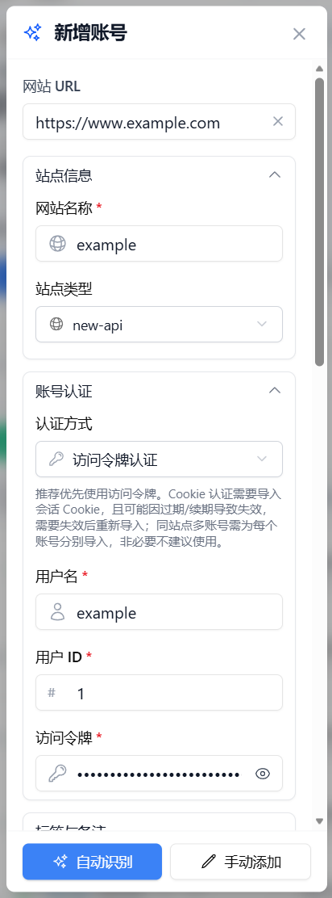
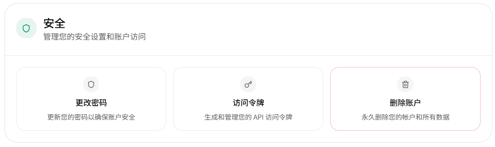
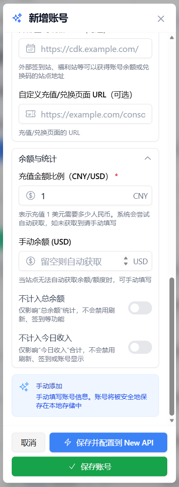
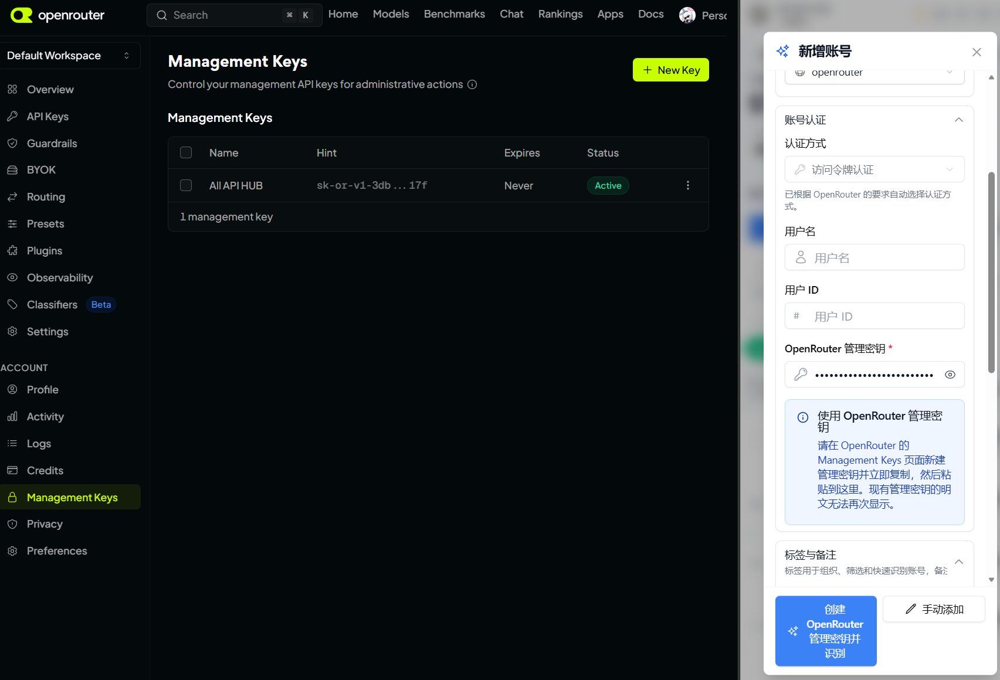
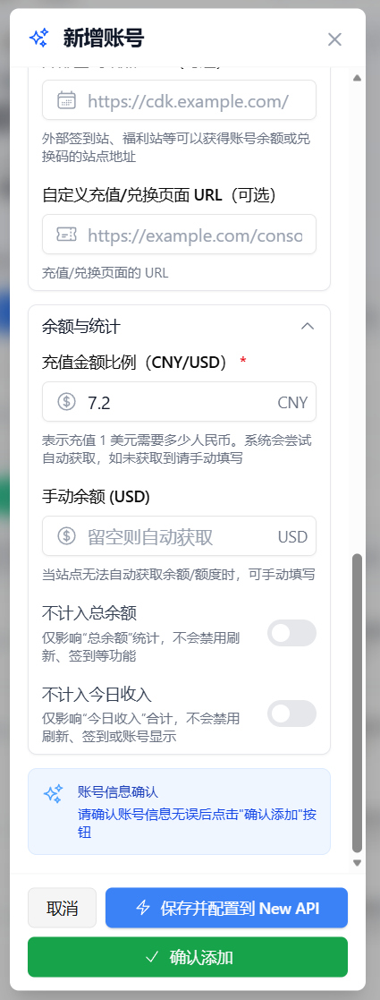

# 账号管理

> 本文档介绍了如何在 All API Hub 中高效地添加、组织和维护你的 AI 站点账号。

## 1. 添加账号

All API Hub 支持多种添加账号的方式，以适配不同类型的站点和安全设置。

### 1.1 自动识别 (推荐)
这是最简单的方式。你只需在浏览器中先登录目标站点，然后在插件中执行：
1. 点击 **“新增账号”**。
2. 填写站点的 **网站 URL**。
3. 点击 **“自动识别”**。
4. 插件会尝试识别站点类型和当前登录账号，并自动补全添加账号所需的信息。

### 1.2 手动添加

不同站点类型需要填写的信息及其获取位置可能不同。下面按站点类型分别介绍如何手动添加账号。

> **站点类型**为可选项：可以不选择；未选择站点类型时仍然可以保存账号，保存后站点类型会记录为 `unknown`，之后不会因为未选择站点类型而再次要求选择。

快速跳转：
- [New API](#manual-new-api)
- [Sub2API](#manual-sub2api)
- [OpenRouter](#manual-openrouter)

#### 1.2.1 New API

> 不同 New API 二开站点的页面布局、按钮名称和功能位置可能存在差异，请以实际网站界面为准。

1. 登录你的 New API 网站。
2. 点击浏览器右上角的 **All API Hub** 扩展图标。建议以侧边栏方式打开，方便后续对照填写。
3. 点击 **“新增账号”**，使用当前站点地址或手动填写地址。
4. 点击 **“手动添加”**。

   

5. 在表单中填写以下信息，点击字段名称可以跳转到下方对应的填写说明：

   - [**网站名称**](#manual-new-api-site-name)
   - [**站点类型**](#manual-new-api-site-type)
   - [**用户名、用户 ID**](#manual-new-api-user-id)
   - [**访问令牌**](#manual-new-api-access-token)

   

   **网站名称**：用于在插件中区分账号，可以自定义。

   

   **站点类型**：选择 `new-api`。

   

   

   **5.1 怎么获取用户名与用户 ID**

   登录 New API 网站后，进入“个人资料 / 个人信息”页面，在该页面可以看到用户名与用户 ID。

   

   

   **5.2 怎么获取访问令牌**

   进入 New API 网站的个人资料页面后向下滚动，在“安全”栏目中找到“访问令牌”，点击即可生成 / 获取访问令牌。请注意，这里的访问令牌不是“令牌管理”中用于调用模型的 API Key。

   

6. 填写 **充值金额比例**（`CNY/USD`，需大于 0）后即可保存账号。具体充值比例请前往实际使用的网站查询，再填写该网站对应的实际比例。

   

::: tip 填写建议
优先使用 **访问令牌认证**。如果保存后无法刷新账号，请先检查站点类型、用户 ID 和访问令牌是否填写正确；只有目标站点明确需要时，再尝试 Cookie 认证。
:::

::: warning 保护账号信息
访问令牌和 Cookie 都属于敏感信息。请勿将完整内容发给他人，也不要在公开截图或问题反馈中暴露这些信息。
:::

#### 1.2.2 Sub2API

> 不同 Sub2API 站点的页面布局、按钮名称和功能位置可能存在差异，请以实际网站界面为准。
> Sub2API 的访问令牌保存在浏览器本地存储中，且登录令牌有时效，建议优先使用 **自动识别**（见 1.1）方式添加；如需手动添加，请参考以下步骤。

1. 登录你的 Sub2API 网站。
2. 点击浏览器右上角的 **All API Hub** 扩展图标。建议以侧边栏方式打开，方便后续对照填写。
3. 点击 **“新增账号”**，使用当前站点地址或手动填写地址。
4. 点击 **“手动添加”**。

   

5. 在表单中填写以下信息，点击字段名称可以跳转到下方对应的填写说明：

   - [**网站名称**](#manual-sub2api-site-name)
   - [**站点类型**](#manual-sub2api-site-type)
   - [**用户 ID**](#manual-sub2api-user-id)
   - [**访问令牌**](#manual-sub2api-access-token)

   

   **网站名称**：用于在插件中区分账号，可以自定义。

   

   **站点类型**：选择 `sub2api`。

   

   

   **5.1 怎么获取用户 ID**

   Sub2API 的个人资料页面只显示用户名和邮箱，不会直接显示数字用户 ID，需要通过开发者工具获取：

   1. 登录 Sub2API 网站后，按 `F12` 打开开发者工具。
   2. 切换到 **Network（网络）** 标签，按 `F5` 刷新页面。
   3. 在请求列表中找到 `auth/me` 请求，点击打开它的 **Response（响应）**。
   4. 在 `"data"` 中找到 `"id"` 字段，该数字就是你的用户 ID。

   > 备选方式：在开发者工具中选择 **Application（应用）** → **Local Storage** → 站点域名，找到 `auth_user`，其中的 `id` 字段也是你的用户 ID。

   

   **5.2 怎么获取访问令牌**

   Sub2API 的访问令牌保存在浏览器本地存储中，页面不会直接显示，需要通过开发者工具获取：

   1. 登录 Sub2API 网站后，按 `F12` 打开开发者工具。
   2. 切换到 **Application（应用）** → **Local Storage** → 站点域名。
   3. 找到 `auth_token`，复制它的值（一长串以 `eyJ` 开头的字符串），这就是访问令牌。

   > 请注意，这里的访问令牌用于登录站点，不是“API 密钥”页面中用于调用模型的 API Key，两者不要混淆。

   ::: warning 令牌时效
   Sub2API 的访问令牌有时效，过期后需要重新登录。只要账号已添加，插件会自动用刷新令牌保持登录，无需反复手动复制。
   :::

6. 填写 **充值金额比例**（`CNY/USD`，需大于 0）后即可保存账号。

   Sub2API 网站本身不提供“充值金额比例”数据，无需前往站点查询。自动识别时会默认填入 **7.2**（表示 1 美元约等于 7.2 元人民币），直接保留即可；想更准确也可以按当天人民币兑美元汇率手动填写（通常在 7.1–7.3 区间）。该值只用于把美元余额换算成人民币显示，不影响账号功能。

   

::: tip 填写建议
Sub2API 仅支持 **访问令牌认证**（不支持 Cookie 模式），请优先使用 **自动识别** 添加账号，插件会自动读取令牌并补全用户 ID。如果保存后无法刷新账号，请先检查站点类型、用户 ID 和访问令牌是否填写正确。
:::

::: warning 保护账号信息
访问令牌属于敏感信息，请勿将完整内容发给他人，也不要在公开截图或问题反馈中暴露这些信息。
:::

#### 1.2.3 OpenRouter

1. 登录你的 OpenRouter 网站。
2. 点击浏览器右上角的 **All API Hub** 扩展图标。建议以侧边栏方式打开，方便后续对照填写。
3. 点击 **“新增账号”**，使用当前站点地址或手动填写地址。
4. 点击 **“手动添加”**。

   

5. 在表单中填写以下信息，点击字段名称可以跳转到下方对应的填写说明：

   - [**网站名称**](#manual-openrouter-site-name)
   - [**站点类型**](#manual-openrouter-site-type)
   - [**访问令牌**](#manual-openrouter-access-token)

   

   **网站名称**：用于在插件中区分账号，可以自定义。

   

   **站点类型**：选择 `openrouter`。

   

   

   **5.1 怎么获取访问令牌**

   进入 OpenRouter 网站的控制台页面后，找到 **“Management Keys”**，点击右上角 **“+ New Key”**，填写对应表单后，点击 **“Create”**，然后点击复制您的新 API Key，填入插件中的 **“OpenRouter 管理密钥”**。

   > 注意：该 Key 只能明文显示一次，若丢失请重新创建并填入。

   快捷跳转网站：[https://openrouter.ai/settings/management-keys](https://openrouter.ai/settings/management-keys)

   

6. 填写 **充值金额比例**（`CNY/USD`，需大于 0）后即可保存账号。具体充值比例请前往实际使用的网站查询，再填写该网站对应的实际比例。

   

::: tip 填写建议
优先使用 **访问令牌认证**。如果保存后无法刷新账号，请先检查站点类型、用户 ID 和访问令牌是否填写正确；只有目标站点明确需要时，再尝试 Cookie 认证。
:::

::: warning 保护账号信息
访问令牌和 Cookie 都属于敏感信息。请勿将完整内容发给他人，也不要在公开截图或问题反馈中暴露这些信息。
:::

### 1.3 Cookie 模式
对于某些对接口保护较严或经过特殊定制的站点，如果 Access Token 模式无法工作，可以尝试切换到 **“Cookie 模式”**。在此模式下，插件将利用你当前的登录会话（Cookie）来请求数据。

### 1.4 从书签批量导入

如果你用浏览器书签收藏了各个中转站点，可以通过“从书签批量导入”快速扫描并批量生成账号候选：

- 入口位于账户管理页顶部，以及“新增账号”对话框内（显示为“从书签导入账号”）。
- 书签访问属于**可选权限**，只有在用户授权后，插件才能读取浏览器书签。
- 导入流程为：

  > 授权 → 读取书签树 → 选择范围 → 扫描并生成候选账号 → 预览 → 导入 → 结果汇总

- 已有账号默认跳过，不会重复导入。
- 导入完成后会分别汇总成功、失败和跳过的条目；已有账号默认计入跳过结果。
- 导入失败的条目可以通过“打开添加账号”继续处理。

---

## 2. 优化添加体验

在 **“设置 -> 基础设置 -> 账号管理”** 中，你可以开启以下功能来提升添加账号的效率：

- ⚡ **自动填充当前页面 URL**：开启后，点击“新增账号”时会自动填入当前浏览器标签页的网址，省去手动复制。
- 🔑 **添加后自动创建默认令牌**：开启后，在成功添加账号后，插件会自动尝试在站点后端为你创建一个默认的 API 密钥（Token），方便你直接导出使用。
  - **AIHubMix**：AIHubMix 的 API 密钥完整内容只会在创建时显示一次。添加新的 AIHubMix 账号后（不含“配置到托管站点”流程），插件会先检查该账号是否已有令牌；如果已有令牌，会跳过创建提示；如果没有令牌，会弹出确认对话框，询问是否立即创建默认密钥并展示一次性完整密钥；如果取消，需要之后在“密钥管理”中手动创建并立即保存完整密钥。
- ⚠️ **添加重复账号时提醒**：当尝试添加一个已存在的站点（相同 URL）时，插件会弹出确认提示，防止误加重复账号。你可以选择继续本次添加、取消操作，或直接关闭后续重复账号提醒并继续本次添加。

::: tip 全新 profile 的默认状态
以上开关在全新 profile（未配置过的账号设置）中的默认状态如下：

- 自动填充网址：关闭
- 添加后自动创建默认令牌：关闭
- 添加重复账号时提醒：开启
- 排序优先级：10 项默认全部开启

这是全新 profile 的默认状态，不代表你修改设置之后仍会保持这些状态。
:::

---

## 3. 重复账号清理

如果你不小心添加了许多重复的账号，可以使用内置的清理工具：

1. 进入 **“账户管理”** 页面，在顶部点击 **“扫描重复账号”**。
2. 在打开的 **“重复账号清理”** 对话框中查看扫描结果。
3. 插件会根据 **URL 源站 + 用户 ID** 对账号进行分组；另外还存在按相同管理密钥分组。
4. 你可以选择 **3 种保留策略** 之一，也可以手动选择要保留的账号。
5. 清理前需要二次确认。

---

## 4. 账号组织与排序

随着账号数量增加，你可以通过以下方式保持列表整洁：

### 4.1 标签 (Tags)
- 为账号添加标签（如 `工作`, `个人`, `中转`, `官网`）。
- 在面板顶部通过标签快速过滤。
- 标签系统与书签、API 凭据库共享，支持全局重命名。

### 4.2 置顶 (Pinning)
- 打开账号右侧的 **“…”** 更多菜单，选择 **“置顶账号”**。
- 已置顶的账号可以通过同一菜单选择 **“取消置顶”**。
- 已置顶的账号会在行内显示 Pin 状态标识。
- 置顶的账号将始终显示在列表最上方。

### 4.3 排序优先级 (Sorting Priority)
- 在 **“设置 -> 排序优先级”** 中，你可以自定义全局排序逻辑。详见 [排序优先级设置](./sorting-priority.md)。
- 排序优先级共有 10 项。
- 支持点击列表列头进行排序，已确认的列头排序包括：**余额、今日消费、今日收入、创建时间**。
- 支持手动排序：需要在设置中开启对应开关，开启后列表会出现拖拽手柄；拖拽后顺序会立即保存，刷新后保持；关闭手动排序后恢复为普通列表排序。
- 无论使用哪种排序方式，置顶账号始终保持在列表顶部。

### 4.4 余额与今日收益统计
- 在新增或编辑账号时，可以开启 **“从总余额中排除”**，让该账号不参与弹窗、账号列表以及分享总览快照中的总余额汇总；这不会影响账号刷新、签到或列表显示。
- 如果某个账号的收入不应计入当天汇总，可以开启 **“从今日收益中排除”**。该开关只影响弹窗、账号列表以及分享总览快照中的今日收益合计，不会隐藏账号，也不会停止刷新或签到。

### 4.5 单账号“…”菜单
每个账号右侧的 **“…”** 菜单提供常用的单账号操作。启用状态的账号共 13 项，分为 4 组：

- 密钥列表、密钥管理、模型列表、定位对应渠道（条件）
- 用量日志、充值页面
- 置顶/取消置顶（条件）、刷新、快速签到（条件）、复制邀请链接、分享快照
- 禁用、删除

禁用状态的账号，“…”菜单仅包含：**启用账号、删除**。

---

## 5. 健康状态与错误码

插件会实时监测账号的连通性。如果账号卡片显示“警告”或“异常”，通常是因为：

- **401 Unauthorized**: 登录失效或 Access Token 已过期。
- **429 Too Many Requests**: 触发了站点频率限制，插件会自动排队重试。
- **403 Forbidden**: 通常表示触发了 Cloudflare 防护，请参考 [Cloudflare 过盾助手](./cloudflare-helper.md)。

你可以点击卡片上的健康状态图标查看详细的错误信息。更多常见错误处理请参考 [常见问题](./faq.md)。

---

## 6. 批量操作

在账号管理页面，你可以勾选多个账号进行以下批量操作：
- **选择当前结果**：选中当前搜索结果下的所有账号。
- **取消当前结果选择**：取消当前搜索结果下所有账号的选择。
- **清空全部选择**：清空所有已选中的账号。
- **禁用已选**：禁用所有已选中的账号。
- **复制邀请链接**：复制已选中账号的邀请链接。
- **删除已选**：删除所有已选中的账号（需要二次确认）。
- **退出批量模式**：退出当前的批量操作模式。

- 0 个账号选中时，相应操作不可用；选中账号后，相应操作才会启用。
- “从书签批量导入”是独立入口，不属于上述勾选式批量工具栏。

---

## 相关文档

- [快速入门](./get-started.md)
- [自动刷新与实时数据](./auto-refresh.md)
- [自动签到](./auto-checkin.md)
- [分享快照](./share-snapshot.md)
