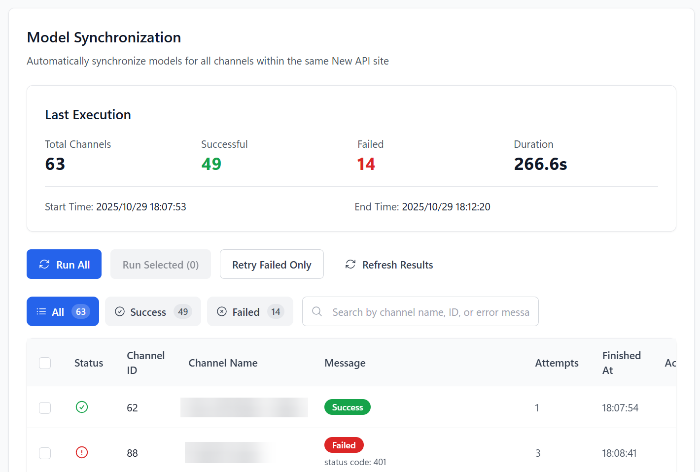

# Managed Site Model Sync

> An automation tool for administrators of self-hosted management panels (New API, AxonHub, Octopus, etc.). Automatically pulls the latest model list from upstream providers and updates your channel configurations, ensuring worry-free synchronization.

## Feature Overview

- 🔄 **Cross-Platform Auto-Sync**: Supports New API, AxonHub, Octopus, and other systems, executing sync automatically at set intervals.
- 🎯 **Flexible Sync Strategies**: Supports full sync, manually selected channel sync, or retrying only the last failed tasks.
- ⚡ **Smart Rate Limiting**: Built-in rate-limiting algorithm to avoid being flagged as an attack by upstream sites when syncing dozens or hundreds of channels in bulk.
- 📊 **Real-time Progress Monitoring**: View the sync status, HTTP status code, and duration of each channel in real-time during the sync process.
- 📜 **Detailed Execution History**: Retains the results of each sync, comparing model list changes before and after for easy tracking.

## Supported System Types

| System Type | Sync Logic |
|----------|----------|
| **New API / DoneHub / Veloera** | Calls `GET /api/channel/fetch_models` to fetch upstream models, then updates channel configuration. |
| **Octopus** | Calls `POST /api/v1/channel/fetch-model` to fetch upstream models. |
| **AxonHub** | Automatically reads and syncs the model list associated with the channel through the AxonHub management interface. |

## Prerequisites

Before starting the sync, you need to complete the connection configuration for the corresponding system (Base URL, Admin Token, or account password) in **Basic Settings -> Self-Hosted Site Management**.

::: tip Tip
After the configuration is complete, select **"Model List Sync"** on the settings page to enter the task management interface.
:::

## Core Operating Workflow

### 1. Manually Execute Tasks
On the "Model Sync" page, you can:
- **Run All**: Syncs channels on the current managed site and skips channels marked to skip. Clicking this button manually also respects skip settings.
- **Run Selected**: Syncs every checked channel, including channels set to skip. This also applies when you select all, and does not change your saved skip settings.
- **Retry Failed Items Only**: Quickly repair channels that failed due to the last network fluctuation.

If a channel cannot provide a model list, or you want to keep its current models, enable "Skip auto-sync and Run All" in Execution History or Manual Execution. Changes save immediately, with an in-progress indicator and a success or failure message. Auto-sync and Run All will no longer fetch or update its models. Execution history records the channel and the reason it was skipped. Skipped channels are counted separately from executed, successful, and failed channels.

The same switch is also available in the channel rule editor, in both visual and JSON modes. Changes in the dialog are saved together with the rules; Cancel discards them.

The skip setting applies only to this channel on the current managed site. Other sites are unaffected, and the setting is included in channel configuration backups. To sync once, use Run Selected or the row's Sync button without turning off the skip setting.

The Skipped filter in Execution History shows channels skipped in that run. "Show channels set to skip" in Manual Execution shows the current settings. Changing a switch does not change past results. Progress, completion messages, and automatic task notifications show skipped counts. If all channels are skipped, the message explicitly says that all were skipped and no models were fetched or updated; every channel remains in the results. Retry Failed Only does not run skipped channels.

### 2. View Execution Results
The sync table displays the following key fields:
- **Status**: Success, failure, or skipped, with a reason for skipped channels.
- **Old Model List**: Models the channel already had before synchronization.
- **New Model List**: Models obtained from the upstream interface in real-time.
- **Error Message**: If it fails, the specific error code (such as 401, 429, 500) and reason will be displayed.

### 3. Configure Automation Options
In the **Settings -> Model List Sync** panel, you can customize the sync behavior:

| Option | Recommended Value | Description |
|------|------|------|
| **Execution Interval** | 6 - 12 hours | The frequency of automatic synchronization; it is not recommended to set it too frequently. |
| **Concurrency** | 1 - 3 | The number of simultaneous sync tasks. It is recommended to keep it within 2 when there are many channels. |
| **Rate Limit (RPM)** | 20 | The maximum number of requests allowed per minute to protect upstream sites. |
| **Max Retries** | 3 | The number of automatic retries after a task fails. |

## FAQ

| Question | Solution |
|------|----------|
| No change in model list after sync | Please check if the upstream site has really updated the models, or if the API Key of the channel has permission to read the model list. |
| Frequent 429 errors | Please lower the "Requests Per Minute" or increase the "Execution Interval." |
| Unable to get AxonHub models | Please confirm that the AxonHub administrator account has sufficient permissions and that the Base URL is filled in correctly. |
| Sync causes some models to be lost | By default, sync will **overwrite** the existing model list. If you have custom models (not returned by upstream), please manually add them after sync or use the Whitelist strategy (Beta). |

## Related Docs

- [Self-Hosted Site Management](./self-hosted-site-management.md): How to configure connection information for self-hosted sites.
- [Model Redirect Management](./model-redirect.md): How to map model names after syncing models.
- [Supported Sites List](./supported-sites.md): View all compatible system types.
