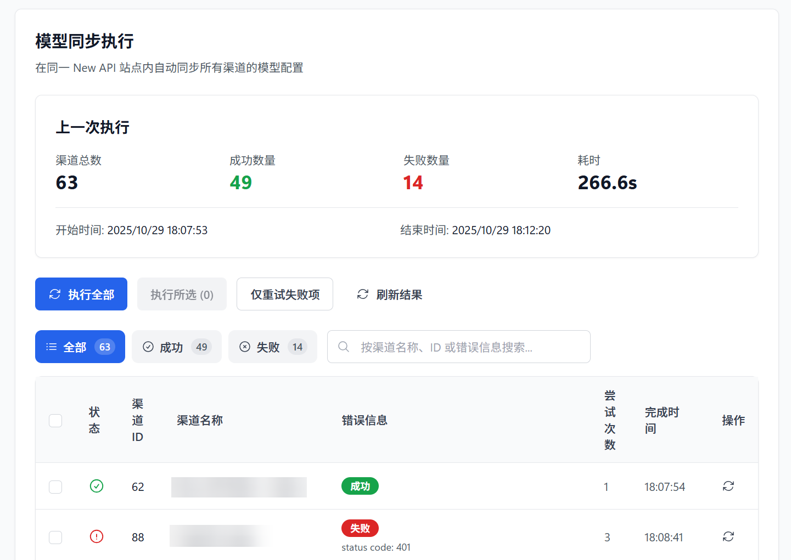

# セルフホスト型サイトモデル同期

> 自社運用の管理パネル（New API, AxonHub, Octopus など）管理者向けの自動化ツールです。上流プロバイダーから最新のモデルリストを自動的に取得し、チャネル設定を更新することで、同期の手間を省きます。

## 機能の概要

- 🔄 **クロスプラットフォーム自動同期**: New API、AxonHub、Octopus など複数のシステムをサポートし、設定した間隔で自動的に同期を実行します。
- 🎯 **柔軟な同期戦略**: 全同期、手動でのチャネル選択同期、または前回の失敗タスクのみのリトライをサポートします。
- ⚡ **インテリジェントな流量制限保護**: 流量制限アルゴリズムを内蔵しており、数十から数百のチャネルを一括同期する際も、上流サイトから攻撃と判定されるのを防ぎます。
- 📊 **リアルタイムの進捗監視**: 同期プロセス中、各チャネルの同期ステータス、HTTP ステータスコード、および所要時間をリアルタイムで確認できます。
- 📜 **詳細な実行履歴**: 各同期の結果を保持し、同期前後のモデルリストの変化を比較できるため、追跡が容易です。

## サポートされているシステムタイプ

| システムタイプ | 同期ロジック |
|----------|----------|
| **New API / DoneHub / Veloera** | `GET /api/channel/fetch_models` を呼び出して上流モデルを取得し、チャネル設定を更新します。 |
| **Octopus** | `POST /api/v1/channel/fetch-model` を呼び出して上流モデルを取得します。 |
| **AxonHub** | AxonHub 管理インターフェースを介して、チャネルに関連付けられたモデルリストを自動的に読み取り、同期します。 |

## 前置要件

同期を開始する前に、 **基本設定 -> セルフホスト型サイト管理** で対応するシステムの接続設定（Base URL、管理者トークン、またはアカウントパスワード）を完了する必要があります。

::: tip ヒント
設定が完了したら、設定ページで **「モデルリスト同期」** を選択してタスク管理インターフェースにアクセスしてください。
:::

## コア操作フロー

### 1. タスクの手動実行
「モデル同期」ページでは、以下の操作が可能です。
- **すべて実行**: 現在の管理サイトのチャネルを同期し、スキップ設定済みのチャネルはスキップします。手動でこのボタンをクリックした場合もスキップ設定に従います。
- **選択分を実行**: スキップ設定済みのチャネルも含め、選択したすべてを同期します。全選択した場合も同じで、保存済みのスキップ設定は変わりません。
- **失敗した項目のみ再試行**: 前回のネットワーク変動などで失敗したチャネルを迅速に修復します。

モデル一覧を取得できないチャネルや、現在のモデルを維持したいチャネルでは、実行履歴または手動実行リストで「自動同期と『すべて実行』をスキップ」を有効にしてください。変更はすぐに保存され、保存中の表示と成功・失敗のメッセージが出ます。自動同期と「すべて実行」では、そのチャネルのモデルを取得・更新しません。実行履歴にはチャネルとスキップ理由が記録されます。スキップ数は実行数・成功数・失敗数とは別に集計されます。

同じスイッチは、チャネルのルール編集ダイアログでも、ビジュアル・JSON の両モードで利用できます。ダイアログ内の変更はルールと一緒に保存され、キャンセルすると破棄されます。

スキップ設定は現在の管理サイトのこのチャネルにだけ適用され、他のサイトには影響しません。チャネル設定のバックアップにも含まれます。一度だけ同期するには、スキップ設定を解除せずに「選択分を実行」または行内の「同期」を使えます。

実行履歴の「スキップ」はその実行でスキップしたチャネルを示し、手動実行リストの「スキップ設定済みのチャネルを表示」は現在の設定を示します。スイッチを変更しても過去の結果は変わりません。進捗、完了メッセージ、自動タスク通知にもスキップ数を表示します。すべてスキップした場合は、モデルの取得・更新を行っていないことを明示し、各チャネルの記録を残します。失敗した項目のみの再試行では、スキップしたチャネルは実行されません。

### 2. 実行結果の確認
同期テーブルには、以下の主要なフィールドが表示されます。
- **ステータス**: 成功、失敗、またはスキップ。スキップしたチャネルには理由を表示します。
- **旧モデルリスト**: 同期前にチャネルに設定されていたモデル。
- **新モデルリスト**: 上流インターフェースからリアルタイムで取得したモデル。
- **エラーメッセージ**: 失敗した場合、具体的なエラーコード（401, 429, 500 など）と理由が表示されます。

### 3. 自動化オプションの設定
 **設定 -> モデルリスト同期** パネルで、同期動作をカスタマイズできます。

| 設定項目 | 推奨値 | 説明 |
|------|------|----------|
| **実行間隔** | 6 - 12 時間 | 自動同期の時間頻度です。頻繁に設定しすぎることはお勧めしません。 |
| **同時実行数** | 1 - 3 | 同時に実行される同期タスクの数です。チャネル数が多い場合は 2 以内に抑えることをお勧めします。 |
| **1 分あたりのリクエスト数（RPM）** | 20 | 上流サイトを保護するために、1 分間に許可される最大リクエスト数です。 |
| **最大リトライ回数** | 3 | タスク失敗時の自動リトライ回数です。 |

## よくある質問

| 質問 | 解決策 |
|------|----------|
| 同期後にモデルリストが変化しない | 上流サイトで実際にモデルが更新されているか、またはそのチャネルの API キーにモデルリストを読み取る権限があるか確認してください。 |
| 429 エラーが頻繁に発生する | 「1 分あたりのリクエスト数」を減らすか、「実行間隔」を長くしてください。 |
| AxonHub のモデルを取得できない | AxonHub の管理者アカウントに十分な権限があること、および Base URL が正しく入力されていることを確認してください。 |
| 同期によって一部のモデルが失われた | デフォルトでは、同期によって既存のモデルリストが**上書き**されます。カスタムモデル（上流から返されないモデル）がある場合は、同期後に手動で追加するか、ホワイトリスト戦略（テスト版）を使用してください。 |

## 関連ドキュメント

- [セルフホスト型サイト管理](./self-hosted-site-management.md): セルフホスト型サイトの接続情報を設定する方法。
- [モデルリダイレクト管理](./model-redirect.md): モデル同期後のモデル名のマッピング方法。
- [サポートされているサイトリスト](./supported-sites.md): 互換性のあるすべてのシステムタイプを確認します。
