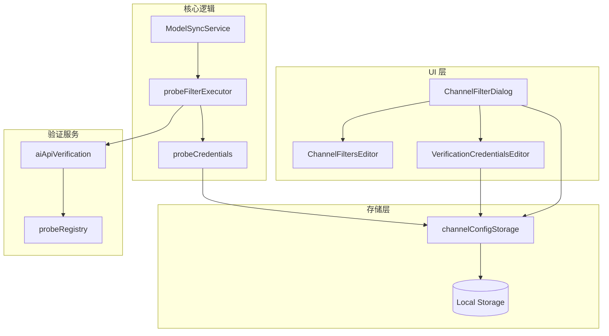

# 渠道 Probe 探测型过滤规则 - 实现总结

## 功能概述

本次实现为渠道过滤规则系统添加了基于 API 探测的新规则类型，允许用户通过实际 API 调用测试模型能力，根据探测结果自动过滤模型列表。

## 核心特性

### 1. 双类型规则系统

- **模式匹配规则（Pattern）**：基于字符串或正则表达式的传统过滤方式
- **探测型规则（Probe）**：通过实际 API 调用测试模型能力

### 2. 支持的探测类型

- `models`: 模型列表探测 - 测试模型是否在 API 的模型列表中
- `text-generation`: 文本生成探测 - 测试基础文本生成能力
- `tool-calling`: 工具调用探测 - 测试 Function Calling 支持
- `structured-output`: 结构化输出探测 - 测试 JSON Schema 约束输出
- `web-search`: 联网搜索探测 - 测试联网搜索能力

### 3. 三层凭证解析

探测规则的凭证按以下优先级解析：

1. **规则级凭证**：规则中直接配置的 Base URL、API 密钥和 API 类型
2. **渠道级凭证**：渠道配置中的默认校验凭证（`verificationCredentials`）
3. **渠道自身凭证**：渠道的 `base_url` 和 `key`（如果可用）

### 4. 自动凭证带入

从 API 凭证创建渠道时，校验凭证会自动保存到 `ChannelConfig.verificationCredentials`，无需手动配置。

## 技术实现

### 类型扩展

#### `ChannelModelFilterRule`

新增字段：

```typescript
ruleType?: "pattern" | "probe"
probeId?: "models" | "text-generation" | "tool-calling" | "structured-output" | "web-search"
apiType?: string
verificationBaseUrl?: string
verificationApiKey?: string
```

#### `ChannelConfig`

新增字段：

```typescript
verificationCredentials?: {
  baseUrl: string
  apiKey: string
  apiType: string
  sourceProfileId?: string
  updatedAt: number
}
```

### 核心模块

#### 1. `probeCredentials.ts`

凭证解析器，实现三层回退逻辑：

- `resolveProbeCredentials()`: 解析探测规则所需的凭证

#### 2. `probeFilterExecutor.ts`

Probe 执行引擎：

- `runProbeForModel()`: 对单个模型执行单个探测
- `filterModelsByProbeRules()`: 批量应用探测规则到模型列表

特性：
- 支持超时控制（默认 30 秒）
- 集成速率限制器
- 提供进度回调
- 自动处理探测失败

#### 3. `modelSyncService.ts`

集成点：

- `applyChannelFilters()` 方法改为异步，先应用模式规则，再应用探测规则
- 探测规则复用现有的 `RateLimiter`，避免触发 API 限流

#### 4. `channelConfigStorage.ts`

存储层更新：

- `normalizeFilters()` 和 `sanitizeFilter()` 支持 probe 规则校验
- 新增 `upsertVerificationCredentials()` 和 `clearVerificationCredentials()` 方法
- 新增 runtime actions: `ChannelConfigUpsertVerificationCredentials` 和 `ChannelConfigClearVerificationCredentials`
- 自动脱敏日志中的敏感信息（复用 `redactSecrets`）

### UI 组件

#### 1. `ChannelFiltersEditor.tsx`

- 新增规则类型选择器（模式匹配 / 探测型）
- 为探测规则提供专用表单：探测类型、API 类型、校验凭证
- 密钥字段支持显示/隐藏切换
- 显示性能提示和凭证说明

#### 2. `VerificationCredentialsEditor.tsx`（新组件）

渠道级校验凭证管理界面：

- 支持查看、编辑、清除渠道默认校验凭证
- 显示凭证来源（如果来自 API 凭证配置）
- 密钥脱敏显示
- 集成到 `ChannelFilterDialog` 顶部

#### 3. `ChannelFilterDialog.tsx`

- 加载和保存完整的 `ChannelConfig`（包括 `verificationCredentials`）
- 集成 `VerificationCredentialsEditor` 组件
- 更新校验逻辑，支持 probe 规则必填字段验证

#### 4. `useChannelDialog.ts`

- `openWithCredentials()` 方法扩展，接受 `apiType` 和 `profileId`
- 渠道创建成功后自动保存校验凭证到 `ChannelConfig`

## 国际化

已添加完整的中英文文案：

- `src/locales/zh_CN/managedSiteChannels.json`
- `src/locales/en/managedSiteChannels.json`

包括：
- 规则类型标签
- 探测类型名称
- 校验凭证相关文案
- 性能提示和使用说明

## 测试覆盖

### 单元测试

1. **`probeCredentials.test.ts`**
   - 凭证解析优先级测试
   - 边界情况（缺失字段、空白字符）
   - 非 probe 规则处理

2. **`channelConfigStorage.test.ts`**
   - Pattern 规则校验
   - Probe 规则校验
   - 校验凭证 CRUD 操作
   - 混合规则类型处理

3. **`probeFilterExecutor.test.ts`**
   - 单个探测执行（成功/失败/超时/错误）
   - Include/Exclude 规则逻辑
   - 凭证缺失处理
   - 进度回调

## 使用流程

### 场景 1: 从 API 凭证创建渠道（自动带入凭证）

1. 在 API 凭证管理页面，点击某个凭证的"导出到托管站点"
2. 渠道创建成功后，校验凭证自动保存
3. 编辑渠道过滤规则，添加探测型规则，无需手动填写凭证

### 场景 2: 手动创建渠道（手动配置凭证）

1. 在渠道管理页面手动创建渠道
2. 点击"编辑渠道过滤规则"
3. 在对话框顶部的"渠道校验凭证"区域配置默认凭证
4. 添加探测型规则，规则会自动使用渠道级凭证

### 场景 3: 规则级独立凭证

如果某个探测规则需要使用不同的凭证（例如测试不同的 API 提供商）：

1. 在探测规则表单中直接填写 `verificationBaseUrl` 和 `verificationApiKey`
2. 该规则会优先使用自己的凭证，不受渠道级凭证影响

## 性能考虑

- 探测规则会对每个模型执行实际 API 调用，可能较慢且消耗配额
- 建议先使用模式匹配规则缩小范围，再应用探测规则
- 探测过程自动应用速率限制（与模型同步共享 `RateLimiter`）
- 单个探测默认超时 30 秒，避免长时间阻塞

## 安全性

- 所有敏感信息（API 密钥）在日志中自动脱敏
- UI 中密钥字段默认隐藏，支持切换显示
- 校验凭证存储在本地 storage，不会发送到远程服务器
- Runtime message 处理中自动提取并脱敏所有密钥

## 文档更新

已更新 `docs/docs/new-api-channel-management.md`，新增"渠道过滤规则"章节，包括：

- 规则类型说明
- 探测型规则的凭证配置方法
- 性能注意事项
- 使用示例

## 待办事项

实现已完成，用户可以：

1. 安装依赖：`pnpm install`（如果尚未安装）
2. 运行测试：`pnpm test`
3. 启动开发服务器：`pnpm dev`
4. 在浏览器中测试新功能

## 相关文件

### 新增文件

- `src/services/models/modelSync/probeCredentials.ts`
- `src/services/models/modelSync/probeFilterExecutor.ts`
- `src/features/ManagedSiteChannels/components/VerificationCredentialsEditor.tsx`
- `tests/services/models/modelSync/probeCredentials.test.ts`
- `tests/services/managedSites/channelConfigStorage.test.ts`
- `tests/services/models/modelSync/probeFilterExecutor.test.ts`

### 修改文件

- `src/types/channelModelFilters.ts`
- `src/types/channelConfig.ts`
- `src/services/managedSites/channelConfigStorage.ts`
- `src/constants/runtimeActions.ts`
- `src/services/models/modelSync/modelSyncService.ts`
- `src/components/dialogs/ChannelDialog/hooks/useChannelDialog.ts`
- `src/features/ApiCredentialProfiles/hooks/useApiCredentialProfilesController.ts`
- `src/components/ChannelFiltersEditor.tsx`
- `src/features/ManagedSiteChannels/components/ChannelFilterDialog.tsx`
- `src/locales/zh_CN/managedSiteChannels.json`
- `src/locales/en/managedSiteChannels.json`
- `docs/docs/new-api-channel-management.md`

## 架构图



## 下一步

建议的后续优化：

1. 添加探测结果缓存，避免重复探测
2. 支持批量探测并行化（当前是串行）
3. 添加探测历史记录和统计
4. 支持自定义探测超时时间
5. 添加探测规则的"测试运行"功能，预览过滤结果
