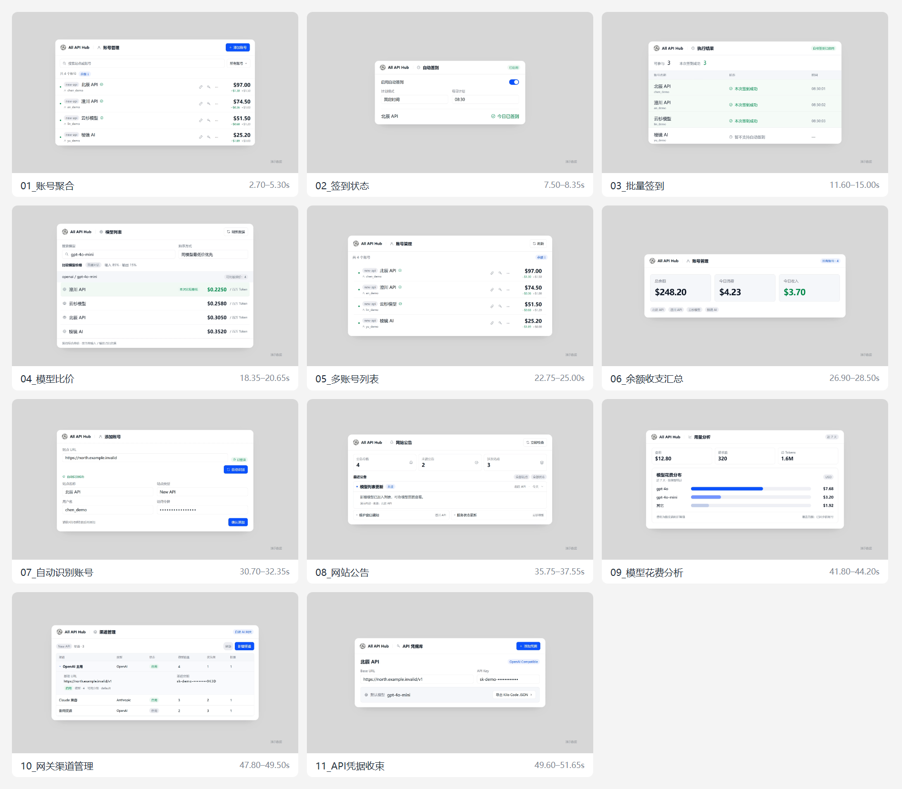
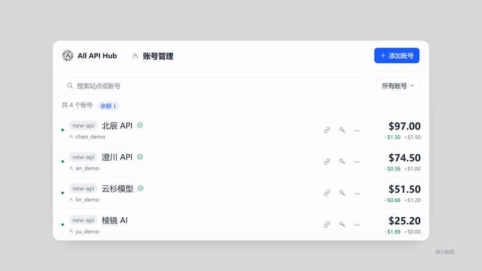

# All API Hub 产品动画素材

11 个可独立预览、修改和渲染的 Remotion 镜头，用于穿插在已有文字动画之间。每个镜头只表达一个真实产品功能，使用演示数据和确定性的逐帧动画。代码与扩展的业务逻辑、依赖和构建隔离，不访问真实账号或网络服务。



账号聚合镜头（压缩预览）：



## 预览与渲染

需要 Node.js 24 或更新版本。在仓库根目录运行：

```sh
cd tools/product-video
npm ci
npm run studio
```

在 Studio 左侧选择镜头，即可播放、拖动时间轴和检查单帧。第一次使用需要下载浏览器，可提前运行 `npx remotion browser ensure`。也可以设置 `CHROME_PATH` 指向本地 Chrome/Chromium 可执行文件，Studio 和渲染脚本均支持该变量。

```sh
npm run check
npm run render:stills
npm run render
# 只渲染一个镜头
npm run render -- --shot=PriceScene
```

`output/shots/` 存放独立的无声 MP4；`output/stills/` 存放每个镜头的起始、运动中和结束检查帧。输出目录不提交到 Git。默认输出 1920 × 1080、60 FPS、H.264、YUV420P、BT.709，PNG 逐帧采样、CRF 14。每段前后各保留 18 帧（0.3 秒）稳定画面；不含音乐、配音、鼠标或转场。

中文字体依次使用 Microsoft YaHei、PingFang SC、Noto Sans CJK SC。原始素材在 Windows 上检查；其他平台请安装对应中文字体，并重新检查字形和排版。

## 镜头与编辑位置

时间位置是已有文字视频中的建议切入区间。导出的素材包含额外 0.6 秒的剪辑余量，剪辑时可从第 18 帧开始对齐。

| Composition | 展示功能 | 时间位置（秒） | 素材长度（秒） |
| --- | --- | --- | --- |
| AccountsHero | 账号聚合 | 2.70–5.30 | 3.20 |
| CheckinPeek | 签到状态 | 7.50–8.35 | 1.45 |
| CheckinBatch | 批量签到 | 11.60–15.00 | 4.00 |
| PriceScene | 同模型报价比较 | 18.35–20.65 | 2.90 |
| AccountsList | 多账号列表 | 22.75–25.00 | 2.85 |
| AccountsSummary | 余额与当日收支汇总 | 26.90–28.50 | 2.20 |
| AddAccountScene | 自动识别账号 | 30.70–32.35 | 2.25 |
| AnnouncementsScene | 网站公告 | 35.75–37.55 | 2.40 |
| UsageScene | 模型花费分析 | 41.80–44.20 | 3.00 |
| GatewayScene | 网关渠道管理 | 47.80–49.50 | 2.30 |
| CredentialsScene | API 凭据与配置导出 | 49.60–51.65 | 2.65 |

- `src/shot-plan.json`：时间、帧数、运动结束位置及对应真实功能的源码位置（相对于仓库 `src/`）。
- `src/CoreScenes.tsx`：账号、签到、价格比较镜头。
- `src/FeatureScenes.tsx`：添加账号、公告、用量、网关和凭据镜头。
- `src/shared.tsx`：舞台、面板、品牌元素、演示数据和缓动工具。
- `src/index.tsx`：镜头注册；`scripts/render.mjs`：批量渲染入口。

动画以帧号计算，不依赖 CSS 实时时钟或随机值。修改时同步更新镜头计划，保留前后稳定帧以及最终状态停留。

## 产品事实与演示数据

功能核对基于仓库提交 `12bfc23e16c593627e0524da26074c5ef4795dda`（4.1.0），整理进仓库时基于 `7aac6134e`（4.2.0）。画面是适合视频构图的独立 UI，并非扩展界面的逐像素复刻；后续功能变化时应重新核对镜头计划中的源码位置。

- 批量签到展示三个适配账号成功、一个不支持的账号未执行；不表达所有站点均支持签到。
- 报价为同模型的演示估算（普通聊天场景、输入 85% / 输出 15%），只突出本次比较中的最低报价。
- 四个账号总余额为 $248.20，当日消费 $4.23、收入 $3.70；用量镜头展示独立的近七天演示统计。
- 添加账号停留在识别结果和待确认表单；网关镜头展示已有渠道的配置管理，不表示执行了请求路由。
- 凭据镜头展示 Base URL、遮罩 Key、默认模型以及真实存在的 Kilo 配置导出入口。
- 域名使用 `.example.invalid`，密钥使用遮罩，画面标注“演示数据”。

原始文字视频、Apple 参考视频及个人电脑路径不属于这个可复现项目。代码遵循仓库 LICENSE；依赖遵循各自许可。

## 验收

安装 FFmpeg（包含 ffprobe）并加入 PATH 后运行：

```sh
npm run verify
npm run verify -- --shot=PriceScene
```

可使用 `FFMPEG_BINARY` 和 `FFPROBE_BINARY` 指定可执行文件。验证脚本检查输出格式、帧数、无音轨、完整解码、稳定剪辑余量及明显空白/闪帧，结果写入 `output/validation*.json`。它不能代替视觉检查：交付前仍需查看运动中和最终画面，确认字体、裁切、信息层级和功能表达。

根项目的 TypeScript 与 ESLint 排除此独立目录，避免把视频依赖纳入浏览器扩展；视频代码使用自己的 `npm run check` 进行类型与脚本语法检查。
